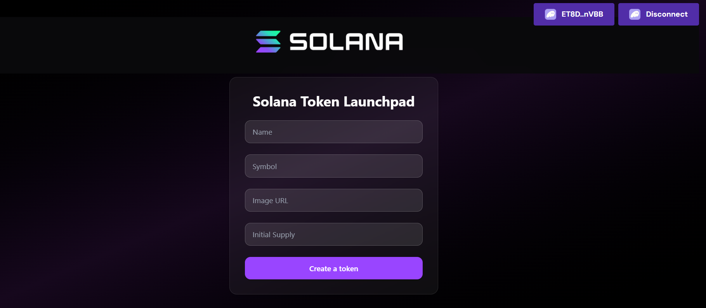

# 🎯 Solana Token Launchpad

Live Link: https://token-launchpad-solana-13.vercel.app/

🚀 A simple and powerful token creation tool on **Solana**, built using the **Token Program 2022**. Launch your own SPL token in seconds by just filling out a form — no manual minting or CLI needed!



## 🔹 How It Works

1️⃣ Connect your Solana wallet (Phantom, Backpack, etc.)  
2️⃣ Enter your token details:
- ✅ Token Name  
- ✅ Symbol  
- ✅ Image URI  
- ✅ Initial Supply  
3️⃣ Click **Launch Token**  
4️⃣ The app automatically:
   - Creates a **mint account**
   - Initializes **metadata**
   - Sets up an **associated token account**
   - Mints your tokens to your wallet

All powered by **Token Program 2022**.

## 🔹 Tech Stack

- **Frontend:** React.js  
- **Solana SDK:** `@solana/web3.js`  
- **Wallet Integration:** `@solana/wallet-adapter`  

## 💡 Why Token Program 2022?

✅ Improved flexibility  
✅ Metadata support  
✅ Better compatibility with evolving token standards on Solana  

## 🛠 Setup Instructions

### 1. Clone the repo

```bash
git clone https://github.com/farman13/solana-token-launchpad.git
cd solana-token-launchpad
